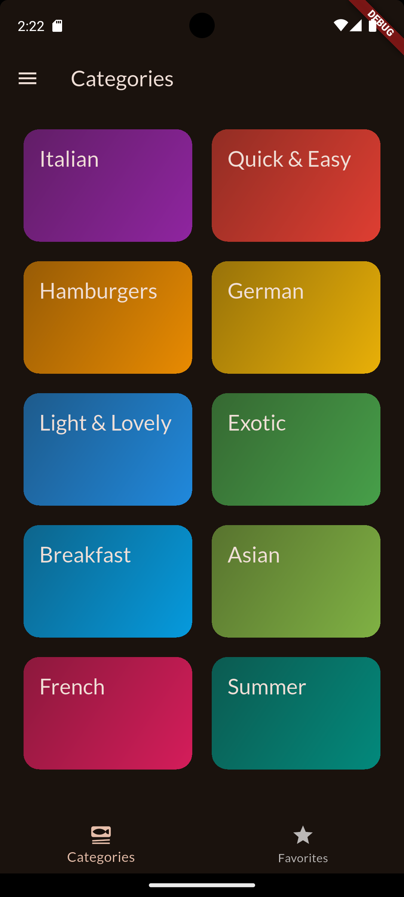
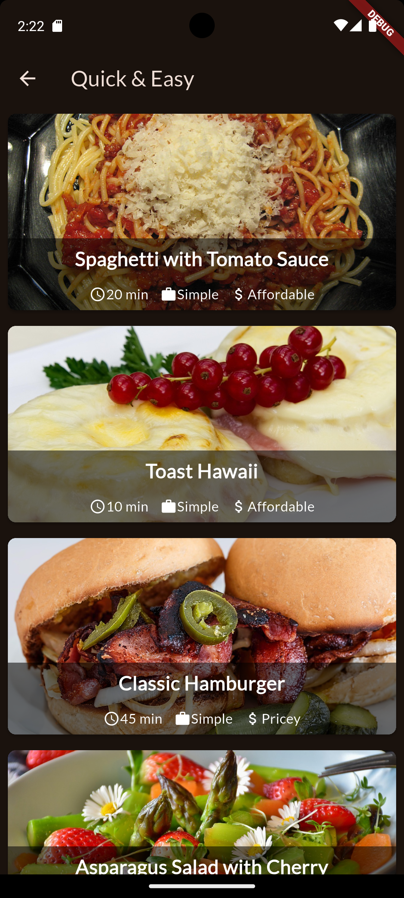

# 🍽️ Flutter Meals App

A Flutter application that lets users browse and filter meals by categories and dietary preferences. It demonstrates Flutter basics such as routing, state management, and UI composition.

---

## 📸 Screenshots

<p float="left">
  
  
</p>

---

## ✨ Features

- 🌍 Browse meals by category
- 🌿 Apply dietary filters (gluten-free, lactose-free, vegetarian, vegan)
- ⭐ Mark meals as favorites
- 🍷 View detailed meal info with ingredients and steps
- 💡 Beautiful and responsive UI

---

## 📁 Project Structure

```
lib/
├── main.dart
├── data/
│   └── dummy_data.dart
├── models/
│   ├── category.dart
│   └── meal.dart
├── screens/
│   ├── categories.dart
│   ├── filters.dart
│   ├── meal_detail.dart
│   ├── meals.dart
│   └── tabs.dart
├── widgets/
│   ├── category_grid_item.dart
│   ├── main_drawer.dart
│   ├── meal_item_trait.dart
│   └── meal_item.dart
```

---

## 🚀 Getting Started

### Installation

```bash
git clone https://github.com/PyWise/meals-app.git
cd flutter-meals-app
flutter pub get
flutter run
```

---

## 🚧 Built With

- Flutter
- Dart
